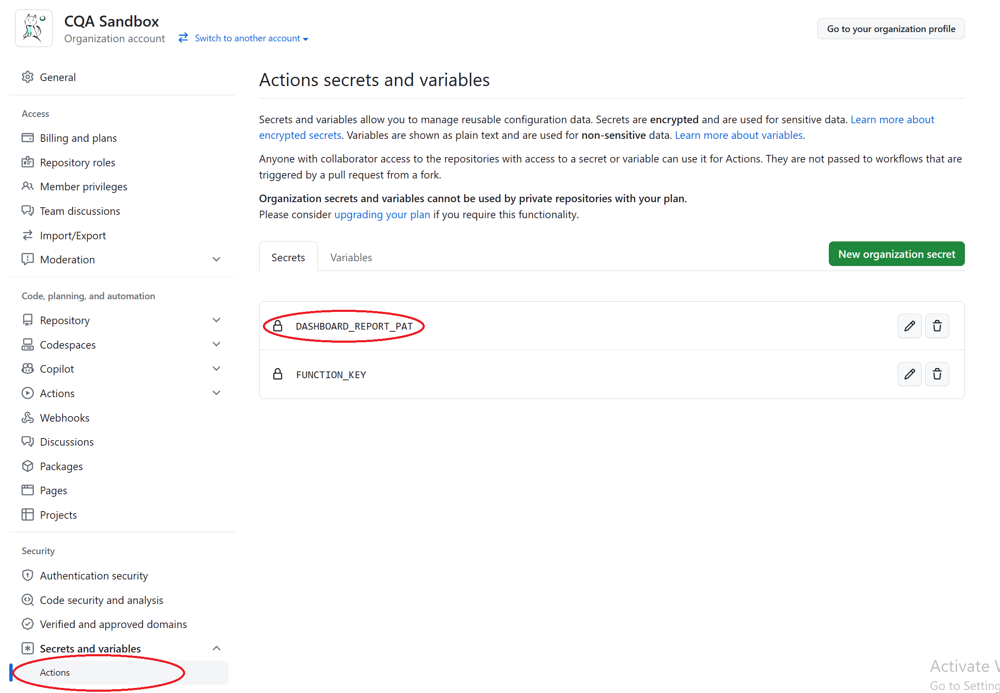

# Modify Current Workflow File to Create Issues

Add a job into the current workflow to automatically create issues upon test failure:

1. Ensure that issues are enabled for the test repository
2. In the GitHub settings of the test repository or its organization, add the Azure function key `FUNCTION_KEY` to its actions secrets. If you are a Microsoft employee who does not have access to the function key of the Azure function that automatically creates issues/PRs you will need to reach out to ____ for the function. If you are not a Microsoft employee or are unable to obtain the function you will need to set up the function app by yourself. You may do so by following the instructions at______. If you do choose to create your own function app remember to update the url in the job below.
      
3. Copy the following job into the `./github/workflows/playwright-onDemand.yml` file right below the job `test`.

    ```yaml
      reportIssues:
        name: Report issues
        if: ${{ failure() }}
        needs: test
        runs-on: ubuntu-latest
        steps:
        - name: Set http web request parameters
          uses: fjogeleit/http-request-action@v1
          with:
            url: 'https://createprpremium.azurewebsites.net/api/CreateIssue?code=${{ secrets.FUNCTION_KEY }}'
            method: 'POST'
            timeout: 15000
            customHeaders: '{"Content-Type": "application/json"}'
            data: '{
                    "IssueComment": "Playwright tests are failing for this repository",
                    "Owner" : "${{github.repository_owner}}",
                    "Repo": "${{ github.event.repository.name }}",
                    "Token": "${{ secrets.DASHBOARD_REPORT_PAT }}",
                    "ToolLabel" : "Nightly Integration Tests" }'
    ```

4. The step above creates an issue in the current test repository stating that Playwright tests have failed. If you would like to change the repository the issue is created in or the message edit the parameters `Owner` and `Repo` or `IssueComent`
